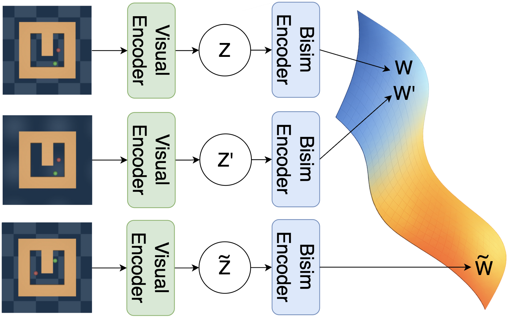
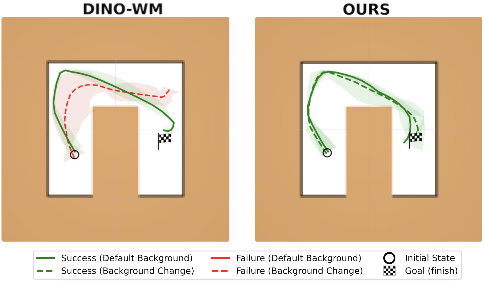

# Learning Invariant Visual Representations for Planning with Joint-Embedding Predictive World Models

[[Paper]](https://arxiv.org/abs/2602.18639)

Leonardo F. Toso\*, Davit Shadunts\*, Yunyang Lu\*, Nihal Sharma, Donglin Zhan, Nam H. Nguyen, James Anderson

Columbia University, Capital One

\* Equal contribution

<p align="center">
  
</p>

## Overview

JEPA-based world models, including [DINO-WM](https://arxiv.org/abs/2411.04983), are sensitive to *slow features* — task-irrelevant visual variations such as background changes, lighting, and distractors that change slowly over time. The predictive objective in JEPAs can be minimized by encoding only such temporally consistent information, leading to degenerate representations that fail under test-time visual shifts.

We address this by augmenting the latent dynamics with a **bisimulation encoder** that enforces control-relevant state equivalence. States with similar transition dynamics are mapped to nearby latent embeddings, while task-irrelevant visual features are discarded. The bisimulation encoder is trained jointly with the transition model, without relying on reward prediction.

Our model operates in a latent space up to **10x smaller** than that of DINO-WM and is agnostic to the choice of pretrained visual encoder (DINOv2, SimDINOv2, iBOT).

<p align="center">
  
</p>

## Results

We evaluate on PointMaze navigation under six test-time visual conditions: No Change (NC), Slight Change (SC), Color (C), Large Color (LC), Large Color Gradient (LCG), and moving Distractors (D).

<p align="center">
  
</p>

| Model | NC | SC | C | LC | LCG | D |
|-------|------|------|------|------|------|------|
| DINO-WM | 0.80 | 0.72 | 0.60 | 0.56 | 0.48 | 0.78 |
| DINO-WM w/ DR | 0.82 | 0.82 | 0.82 | 0.68 | 0.64 | 0.82 |
| **Ours (DINO-Bisim)** | **0.78** | **0.80** | **0.76** | **0.86** | **0.78** | **0.82** |

DINO-WM degrades under background changes (0.80 → 0.48 from NC to LCG). Domain randomization helps when test backgrounds resemble training augmentations but fails under larger shifts. Our model maintains consistent performance across all conditions.

We further validate with different pretrained visual encoders:

| Model | NC | SC | C | LC | LCG | D |
|-------|------|------|------|------|------|------|
| No Encoder | 0.68 | 0.44 | 0.70 | 0.26 | 0.36 | 0.64 |
| **DINOv2** | **0.78** | **0.80** | **0.76** | **0.86** | **0.78** | **0.82** |
| SimDINOv2 | 0.40 | 0.38 | 0.36 | 0.42 | 0.42 | 0.36 |
| iBOT | 0.72 | 0.70 | 0.74 | 0.72 | 0.72 | 0.72 |

## Getting Started

### Installation

```bash
git clone https://github.com/jd-anderson/dino_bsmpc.git
cd dino_bsmpc
conda env create -f environment.yaml
conda activate dino_wm
```

#### MuJoCo

Create the `.mujoco` directory and download MuJoCo210:

```bash
mkdir -p ~/.mujoco
wget https://mujoco.org/download/mujoco210-linux-x86_64.tar.gz -P ~/.mujoco/
cd ~/.mujoco
tar -xzvf mujoco210-linux-x86_64.tar.gz
```

Add to `~/.bashrc`:

```bash
export LD_LIBRARY_PATH=$LD_LIBRARY_PATH:/home/<username>/.mujoco/mujoco210/bin
export LD_LIBRARY_PATH=$LD_LIBRARY_PATH:/usr/lib/nvidia
```

### Datasets

Datasets are provided by [DINO-WM](https://github.com/gaoyuezhou/dino_wm) and can be downloaded [here](https://osf.io/bmw48/?view_only=a56a296ce3b24cceaf408383a175ce28).

Set the dataset path:
```bash
export DATASET_DIR=/path/to/data
```

Expected structure:
```
data
├── deformable
│   ├── granular
│   └── rope
├── point_maze
├── pusht_noise
└── wall_single
```

## Training

Train a world model with the bisimulation encoder:

```bash
python train.py --config-name train.yaml env=point_maze frameskip=5 num_hist=3
```

Key bisimulation hyperparameters can be set via Hydra overrides:
```bash
python train.py --config-name train.yaml env=point_maze frameskip=5 num_hist=3 \
    bisim_latent_dim=32 \
    training.bisim_lr=5e-7 var_loss_coef=1
```

Hyperparameter sweeps:
```bash
python train_sweep.py --config-file train_sweep_config.json --gpus 0 1 2 3
```

Model checkpoints are saved to `<ckpt_base_path>/outputs/`. Set `ckpt_base_path` in `conf/train.yaml`.

### Encoder Selection

The pretrained visual encoder is specified via the `encoder` config group:
```bash
# DINOv2 (default, ViT-S/14, d_z=384)
python train.py --config-name train.yaml encoder=dino ...

# SimDINOv2 (ViT-B/16, d_z=768)
python train.py --config-name train.yaml encoder=simdino ...

# iBOT (ViT-S/16, d_z=384)
python train.py --config-name train.yaml encoder=ibot ...
```

To train the bisimulation encoder directly from pixels (bypassing the pretrained encoder):
```bash
python train.py --config-name train.yaml model.bypass_dinov2=True ...
```

## Planning

Plan with a trained model using MPC with CEM:

```bash
python plan.py model_name=<model_name> n_evals=5 planner=cem goal_H=5 \
    goal_source='random_state' planner.opt_steps=30
```

Environment-specific planning configs:
```bash
python plan.py --config-name plan_point_maze.yaml model_name=point_maze
python plan.py --config-name plan_pusht.yaml model_name=pusht
python plan.py --config-name plan_wall.yaml model_name=wall
```

Set `ckpt_base_path` in `conf/plan.yaml` to point to the checkpoint directory. Planning logs and visualizations are saved to `./plan_outputs/`.

## Citation

```
@misc{toso2026learninginvariantvisualrepresentations,
      title={Learning Invariant Visual Representations for Planning with Joint-Embedding Predictive World Models}, 
      author={Leonardo F. Toso and Davit Shadunts and Yunyang Lu and Nihal Sharma and Donglin Zhan and Nam H. Nguyen and James Anderson},
      year={2026},
      eprint={2602.18639},
      archivePrefix={arXiv},
      primaryClass={cs.LG},
      url={https://arxiv.org/abs/2602.18639}, 
}
```

## Acknowledgements

This codebase builds on [DINO-WM](https://github.com/gaoyuezhou/dino_wm) by [Zhou et al.](https://arxiv.org/abs/2411.04983).
