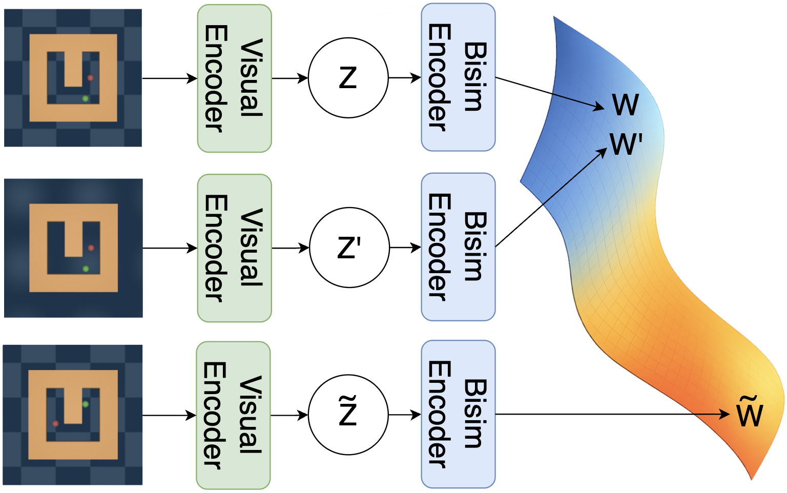
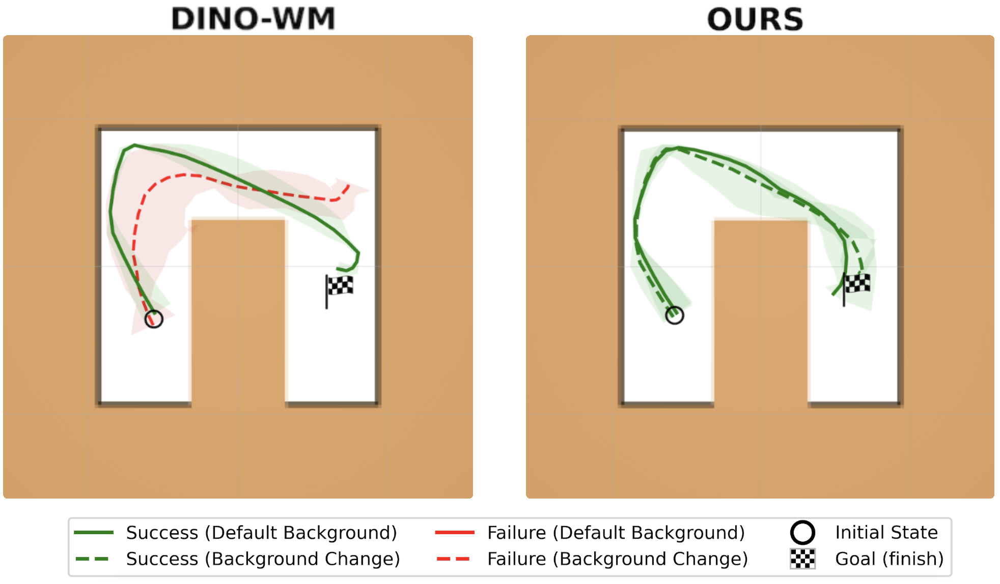
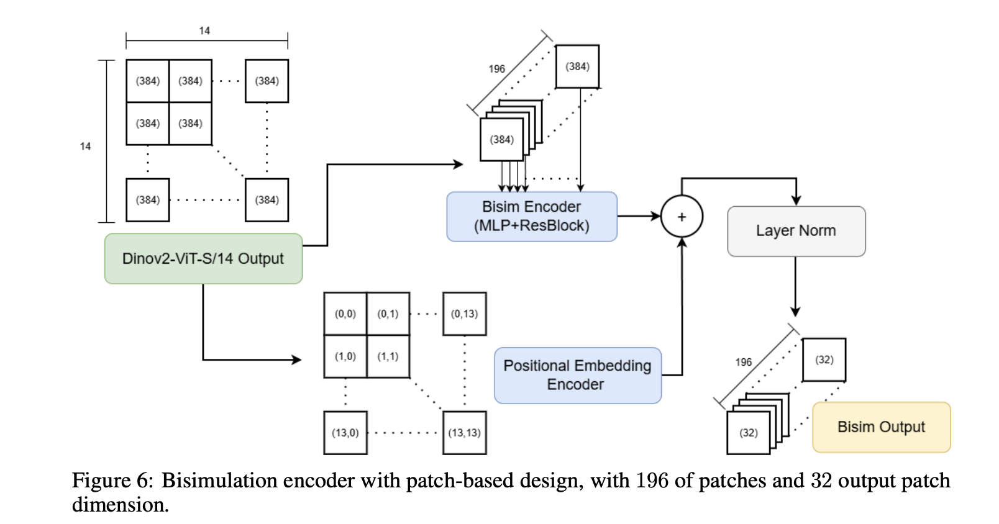

# Learning Invariant Visual Representations for Planning with Joint-Embedding Predictive World Models

[[Paper]](https://arxiv.org/abs/2602.18639)

Leonardo F. Toso\*, Davit Shadunts\*, Yunyang Lu\*, Nihal Sharma, Donglin Zhan, Nam H. Nguyen, James Anderson

Columbia University, Capital One

\* Equal contribution

<p align="center">
  
</p>

## Overview

JEPA-based world models, including [DINO-WM](https://arxiv.org/abs/2411.04983), are sensitive to *slow features* — task-irrelevant visual variations such as background changes, lighting, and distractors that change slowly over time. The predictive objective in JEPAs can be minimized by encoding only such temporally consistent information, leading to degenerate representations that fail under test-time visual shifts.

We address this by augmenting the latent dynamics with a **bisimulation encoder** that enforces control-relevant state equivalence. States with similar transition dynamics are mapped to nearby latent embeddings, while task-irrelevant visual features are discarded. The bisimulation encoder is trained jointly with the transition model, without relying on reward prediction.

Our model operates in a latent space up to **10× smaller** than that of DINO-WM and is agnostic to the choice of pretrained visual encoder (DINOv2, SimDINOv2, iBOT).

<p align="center">
  
</p>

## Architecture

### Latent space (JEPA vs DINO-Bisim)

[DINO-WM](https://arxiv.org/abs/2411.04983) operates on patch-based DINOv2 features: **196 patches × 384** dimensions per frame (**196×384**). Our **patch-based bisimulation encoder** keeps the same **14×14** spatial layout but maps each patch into a **low-dimensional** latent (**196×32** with the hyperparameters in Figure 6). That is **>10×** fewer latent dimensions than DINO-WM’s JEPA space, while improving robustness to slow, task-irrelevant visual variation.

### Patch-based bisimulation encoder

Visual inputs are split into spatial patches; each patch is encoded with a **shared** MLP (plus a residual block), following the patch bisimulation design of Shimizu and Tomizuka [2025] and matching DINOv2’s patch output. **Figure 6** adds a separate **Positional Embedding Encoder** on the 14×14 patch grid: normalized coordinates `(row, col)` are mapped through an MLP to `(196, 32)` and **added** to the encoded features, then **LayerNorm** is applied. Instead of flattening **14×14×384** into a **75,264**-dimensional vector for one large first layer, we run **196 parallel** forward passes with input size **384**. With hidden width **256**, the first-layer parameter count drops from **(75,264×256)+256 ≈ 19.3M** to **(384×256)+256 ≈ 98.6K** (plus the positional MLP).

### End-to-end DINO-Bisim model

At each timestep the model takes **visual observations**, **proprioception**, and **actions**, and predicts the **next bisimulation latent** (optional reward head exists but is **not used** in our experiments). **DINOv2 ViT-S/14** (frozen) produces **196×384** patch tokens; the **bisimulation encoder** (Figure 6) maps them to **196×32** latent patches via MLP+ResBlock, coordinate-based positional encoding, and LayerNorm. Proprio and actions pass through lightweight **1D conv** embedders; embeddings are **concatenated** and processed by a **6-layer transformer** predictor. See the paper (Section 3, Table 3) for full hyperparameters.

<p align="center">
  
</p>
<p align="center"><em>Figure 6: Bisimulation encoder with patch-based design (196 patches, 32 output patch dimensions).</em></p>

### Paper ↔ code (default configs)

Default training configs (`conf/train.yaml`, `conf/train_local.yaml`) match the paper tables below, Figure 6, and the bisim objective above.

**Table 2: Shared hyperparameters for DINO-Bisim training**

| Name | Value | Config key |
|------|-------|------------|
| Image size | 224 | `img_size` |
| Optimizer | AdamW | predictor / action / proprio / bisim / decoder optimizers in `train.py` |
| Decoder learning rate | 3×10⁻⁴ | `training.decoder_lr` |
| Predictor learning rate | 1×10⁻⁵ | `training.predictor_lr` |
| Action encoder learning rate | 1×10⁻⁴ | `training.action_encoder_lr` (proprio + action) |
| Bisimulation learning rate | 5×10⁻⁷ | `training.bisim_lr` |
| Action embedding dim. | 10 | `action_emb_dim` |
| Proprio embedding dim. | 10 | `proprio_emb_dim` |
| Epochs | 50 | `training.epochs` |
| Batch size | 20 | `training.batch_size` |

**Table 3: Bisimulation encoder hyperparameters**

| Name | Value | Config key |
|------|-------|------------|
| Bisimulation memory buffer size | 1000 | `bisim_memory_buffer_size` |
| Bisimulation state comparison size | 200 | `bisim_comparison_size` |
| Action dim. | 10 | env / dataset (`action_emb_dim` at embed time) |
| Num patches | 196 | `(img_size / 16)²` → 14×14 DINOv2 grid |
| Latent dim. | 32 | `bisim_latent_dim` |
| Patch dim. | 32 | same as `bisim_latent_dim` |
| Patch embedding dim. | 384 | DINOv2 ViT-S/14 (`encoder.emb_dim`) |
| MLP hidden width | 256 | `bisim_hidden_dim` |
| Positional encoding | Grid MLP on `(row, col)` | `bisim_pos_encoding: grid_mlp` |
| Positional MLP hidden width | 256 | `bisim_pos_hidden_dim` |

| Component | Paper / Figure 6 | Code |
|-----------|------------------|------|
| Visual encoder | Frozen DINOv2 ViT-S/14, 196×384 patch tokens | `conf/encoder/dino.yaml`, `train_encoder: false` |
| Bisim encoder | Shared MLP+ResBlock: 384→256→32 per patch | `BisimModel.encoder` in `models/bisim.py` |
| Positional embedding encoder | 14×14 grid coords → MLP → 196×32; add to features | `PatchSpatialPosEncoder` (`bisim_pos_encoding: grid_mlp`) |
| Post-encode norm | LayerNorm after addition | `BisimModel.proj_norm` |
| Latent shape | 196×32 | `bisim_latent_dim: 32` |
| Proprio / action | Lightweight 1D conv embedders | `models/proprio.py` (`Conv1d`) |
| Dynamics model | 6-layer transformer predictor | `conf/predictor/vit.yaml` (`depth: 6`) |
| Reward head | Present, not used in experiments | `train_w_reward_loss: false` |
| Bisim loss | \((\|w-w'\|^2 - \gamma\|T(w,a)-T(w',a')\|^2)^2\) + PCA/var | `bisim_coef`, `bisim_transition_target: predictor` |
| DINO-WM aux (Ours runs) | Second predictor on **196×384** DINO tokens + JEPA MSE | `train_dinowm_aux: true`, `predictor_dinowm`, `dinowm_coef` |

**Notes**

- **Figure 6 data flow:** DINO tokens → Bisim Encoder (MLP+ResBlock) → **+** Positional Embedding Encoder → LayerNorm → **196×32** output.
- Each patch is encoded independently with **weight-tied** layers (196 parallel forwards, not a flattened 75,264-d input).
- Default positional encoding is **`grid_mlp`**: normalized patch coordinates `(row, col) ∈ [0,1]²` → MLP (2→256→32). Set `bisim_pos_encoding: learned` when loading older checkpoints that store a `(196, 32)` lookup table; `sincos` is also available for ablations.
- The predictor is trained with MSE on **visual bisim + proprio** latents; actions are inputs only.
- Checkpoints under `outputs/` may use older hyperparameters (e.g. `bisim_latent_dim: 64`, `learned` positional embeddings); load them with the matching values from that run’s `hydra.yaml`.

### Bisimulation loss (JEPA–bisim objective)

We learn a pretrained encoder \(f_\theta\) (frozen DINOv2), bisimulation encoder \(h_\eta\), and dynamics \(T_\phi\) (transformer predictor) so distances in bisimulation space \(W\) approximate an on-policy bisimulation metric. For observations \(o_t, o_{t+1}\) and actions \(a_t\) from \(\mathcal{D}_\pi\):

\[
z_t = f_\theta(o_t), \quad w_t = h_\eta(z_t)
\]

**Dynamics (JEPA) loss** — empirical MSE in code (`z_loss`):

\[
\mathcal{L}_{\mathrm{dyn}}(\eta, \phi) \triangleq \mathbb{E}_{\mathcal{D}_\pi}\!\left[\left\|h_\eta(f_\theta(o_{t+1})) - T_\phi(h_\eta(f_\theta(o_t)), a_t)\right\|^2\right]
\]

**Bisimulation target** — pairs \((o_t, a_t, o_{t+1})\) and \((o'_t, a'_t, o'_{t+1})\) with **independent** actions (random pairing in the replay batch; Castro [2020]):

\[
\Delta_{\mathrm{bisim}}(\eta, \phi) \triangleq \gamma \left\|T_\phi(w_t, a_t) - T_\phi(w'_t, a'_t)\right\|_2^2
\]

**Invariance / bisim metric loss**:

\[
\mathcal{L}_{\mathrm{bisim}}(\eta, \phi) \triangleq \mathbb{E}_{\mathcal{D}_\pi}\!\left[\left(\|w_t - w'_t\|_2^2 - \Delta_{\mathrm{bisim}}(\eta, \phi)\right)^2\right]
\]

**Overall (paper Eq. 2), plus optional DINO-WM aux in code:**

\[
\mathcal{L}_{\mathrm{jepa\text{-}bisim}} = \mathcal{L}_{\mathrm{dyn}} + \lambda_{\mathrm{bisim}}\mathcal{L}_{\mathrm{bisim}}
\]

Implementation (`models/bisim.py`, `models/visual_world_model.py`):

| Symbol | Code |
|--------|------|
| \(f_\theta\) | `encoder` (DINOv2), `train_encoder: false` |
| \(h_\eta\) | `BisimModel.encode` |
| \(T_\phi\) | `predictor` on bisim latents |
| \(\mathcal{L}_{\mathrm{dyn}}\) | `z_loss` (MSE on bisim + proprio) |
| \(\Delta_{\mathrm{bisim}}\) | `bisim_transition_target: predictor` (default): \(\gamma\) × squared distance between **predictor** outputs \(T_\phi(w,a)\) and \(T_\phi(w',a')\); legacy `encoder_next` uses \(h(o_{t+1})\) |
| \(\|w_t - w'_t\|^2\) | patch-mean pool + `bisim_latent_metric: l2` |
| \(\lambda_{\mathrm{bisim}}\) | `bisim_coef` |
| Reward term | off (`train_w_reward_loss: false`) |
| Extra regularization | PCA / VICReg / SigReg on latents (`regularization`) |

When `train_dinowm_aux: true`, an additional \(\mathcal{L}_{\mathrm{JEPA}}^{\mathrm{DINO\text{-}WM}}\) on **384-d** DINO tokens (`predictor_dinowm`, `dinowm_coef`) is trained in parallel. Pairs use batch permutation; optional memory buffer (`bisim_memory_buffer_size`) adds cross-batch negatives (transition target falls back to encoded next states for memory pairs). Logged as `train_bisim_*` / `val_bisim_*` in `training_loss_log.csv`.

## Results

We report planning **success rate** (mean over eval rollouts) under six test-time **sim** visual conditions: **NC** (no change, neutral background), **SC** (slight background change), **C** (tinted background), **LC** (large color shift), **LCG** (large color gradient), and **D** (distractors, including a moving highlight). The success **definition and scale** are task-specific: PointMaze uses goal proximity in \((x,y)\) (`point_maze_wrapper.eval_state`); PushT uses joint agent/block pose and angle in `env/pusht/pusht_wrapper.py` (`eval_state`). The planning loop aggregates SR the same way (mean of per-rollout `success` flags), but the two tasks are not directly comparable. Visual codes are the same in both settings; rendering is set at **environment** time (e.g. `wall_env.visual_condition` / `pusht_env.visual_condition` in the planning config). LaTeX sources for copy into the paper: `result_maze.tex`, `result_pushT.tex`.

<p align="center">
  
</p>

### PointMaze (wall / dot navigation, `point_maze` dataset)

| Model | NC | SC | C | LC | LCG | D |
|-------|------|------|------|------|------|------|
| DINO-WM | 0.80 | 0.72 | 0.60 | 0.56 | 0.48 | 0.78 |
| DINO-WM w/ DR | 0.82 | 0.82 | 0.82 | 0.68 | 0.64 | 0.82 |
| **Ours (DINO-Bisim)** | **0.78** | **0.80** | **0.76** | **0.86** | **0.78** | **0.82** |

DINO-WM degrades under background changes (0.80 → 0.48 from NC to LCG). Domain randomization helps when test backgrounds resemble training augmentations but fails under larger shifts. Our model maintains consistent performance across all conditions.

**Encoder comparison (PointMaze):**

| Model | NC | SC | C | LC | LCG | D |
|-------|------|------|------|------|------|------|
| No Encoder | 0.68 | 0.44 | 0.70 | 0.26 | 0.36 | 0.64 |
| **DINOv2** | **0.78** | **0.80** | **0.76** | **0.86** | **0.78** | **0.82** |
| SimDINOv2 | 0.40 | 0.38 | 0.36 | 0.42 | 0.42 | 0.36 |
| iBOT | 0.72 | 0.70 | 0.74 | 0.72 | 0.72 | 0.72 |

### PushT (`pusht_noise` dataset)

Success rates are **not** comparable to PointMaze numbers above. Planning uses `plan_pusht_local` (`n_evals=50`, `goal_H=5`, `planner.max_iter=5`); six conditions via `eval_pusht_six_conditions.py`. After rollout-sweep training, `scripts/post_train_sixcond_pipeline.sh` runs all six conditions and updates the table below via `scripts/update_readme_pusht_results.py`.

<!-- pusht-rollout-results -->

### PushT rollout sweep (six planning conditions)

Planning: `plan_pusht_local`, `n_evals=50`, `goal_H=5`, `planner.max_iter=5`. Success = mean over 50 eval rollouts per condition.

| Train rollouts | Method | NC | SC | C | LC | LCG | D | Mean | Checkpoint |
|----------------|--------|-----|-----|-----|-----|-----|-----|------|------------|
| 1000 | DINO-Bisim | 0.36 | 0.36 | 0.36 | 0.32 | 0.32 | 0.30 | 0.34 | `2026-06-26/23-30-32` |
| 1000 | DINO-WM | — | — | — | — | — | — | — | pending |
| 5000 | DINO-Bisim | — | — | — | — | — | — | — | pending |
| 5000 | DINO-WM | — | — | — | — | — | — | — | pending |
| full | DINO-Bisim | — | — | — | — | — | — | — | `Checkpoints/` |
| full | DINO-WM | — | — | — | — | — | — | — | pending |

<!-- /pusht-rollout-results -->

**Paper row (DINO-Bisim @ 1000 rollouts)** — same checkpoint as first row above; kept for reference with baselines:

| Model | NC | SC | C | LC | LCG | D |
|-------|------|------|------|------|------|------|
| DINO-WM | — | — | — | — | — | — |
| DINO-WM w/ DR | — | — | — | — | — | — |
| **Ours (DINO-Bisim)** | **0.36** | **0.36** | **0.36** | **0.32** | **0.32** | **0.30** |

**Encoder comparison (PushT):**

| Model | NC | SC | C | LC | LCG | D |
|-------|------|------|------|------|------|------|
| No Encoder | — | — | — | — | — | — |
| **DINOv2** | **0.36** | **0.36** | **0.36** | **0.32** | **0.32** | **0.30** |
| SimDINOv2 | — | — | — | — | — | — |
| iBOT | — | — | — | — | — | — |

## Getting Started

### Installation

```bash
git clone https://github.com/jd-anderson/dino_bsmpc.git
cd dino_bsmpc
conda env create -f environment.yaml
conda activate dino_wm
```

**Aligning an existing env (e.g. on a server):** from the repo root, `conda env update -f environment.yaml` reproduces the pinned stack. Alternatively, after installing PyTorch as in `environment.yaml`’s header, install the **full pip list** with:

```bash
pip install -r requirements-pip.txt
```

That file matches the `pip:` section of `environment.yaml` (including `mujoco-py`, `submitit`, `gym`, etc.). `mujoco-py` still needs a C compiler and MuJoCo 2.1 on `LD_LIBRARY_PATH` on Linux—see [MuJoCo](#mujoco) below.

#### MuJoCo

Create the `.mujoco` directory and download MuJoCo210:

```bash
mkdir -p ~/.mujoco
wget https://mujoco.org/download/mujoco210-linux-x86_64.tar.gz -P ~/.mujoco/
cd ~/.mujoco
tar -xzvf mujoco210-linux-x86_64.tar.gz
```

Add to `~/.bashrc`:

```bash
export LD_LIBRARY_PATH=$LD_LIBRARY_PATH:/home/<username>/.mujoco/mujoco210/bin
export LD_LIBRARY_PATH=$LD_LIBRARY_PATH:/usr/lib/nvidia
```

**PushT** planning (`plan_pusht_local`, `eval_pusht_six_conditions.py`) does **not** import the PointMaze / `mujoco_py` stack, so you can run it without installing MuJoCo 2.1 or compiling `mujoco-py` (PyTorch + the rest of the env is still required). **PointMaze** training and planning still need MuJoCo and `mujoco-py` as in this section.

### Datasets

Datasets are provided by [DINO-WM](https://github.com/gaoyuezhou/dino_wm) and can be downloaded [here](https://osf.io/bmw48/?view_only=a56a296ce3b24cceaf408383a175ce28).

Set the dataset path:
```bash
export DATASET_DIR=/path/to/data
```

Expected structure:
```
data
├── deformable
│   ├── granular
│   └── rope
├── point_maze
├── pusht_noise
└── wall_single
```

## How to run

End-to-end flow for a typical **local PushT** workflow (see `conf/train_local.yaml`); for Slurm / other envs, the same idea applies with `train.yaml` and the `env=*` override.

1. **Activate the environment** (after [Installation](#installation)):

   ```bash
   conda activate dino_wm
   cd <path/to/this-repo>
   ```

2. **Point to datasets** (or rely on the default in `train.py`):

   ```bash
   export DATASET_DIR=/path/to/parent/of/pusht_noise
   # If unset, training defaults DATASET_DIR to <repo>/datasets/data
   ```

3. **Train** (checkpoints, CSV loss log, and image mosaics go under the Hydra run dir—see below):

   ```bash
   python train.py --config-name train_local
   ```

   For **paper / cluster**-style training (Slurm, other tasks):

   ```bash
   python train.py --config-name train.yaml env=point_maze frameskip=5 num_hist=3
   ```

4. **Find outputs** (default `ckpt_base_path=./` in the configs):  
   - Run directory: `outputs/YYYY-MM-DD/HH-MM-SS/` (Hydra [working directory](https://hydra.cc/docs/tutorials/basic/running_your_app/working_directory/)).  
   - Checkpoints: `.../checkpoints/model_*.pth`.  
   - Loss: `.../training_loss_log.csv`, terminal + [Weights & Biases](https://wandb.ai) scalars.  
   - Mosaics: `.../train/`, `.../valid/` (PNGs; loss is **not** drawn on them).

5. **Plan / evaluate in sim** (optional): set `model_name` to the run folder name under `outputs/`, e.g. `2026-04-21/18-44-53`, and set `ckpt_base_path` so `ckpt_base_path/outputs/<model_name>/` contains checkpoints.

   - **All six visual conditions (NC…D)** in one go:

     ```bash
     python eval_pusht_six_conditions.py --model-name YYYY-MM-DD/HH-MM-SS --ckpt-base-path ./
     ```

   - **Single** planning run (see [Planning](#planning) for more):

     ```bash
     python plan.py --config-name plan_pusht_local.yaml model_name=YYYY-MM-DD/HH-MM-SS
     ```

6. **Sweeps** (optional): `python train_sweep.py ...` and `python evaluate_visual_grid.py --config ...` for multi–checkpoint tables.

**Hydra tips:** any config value can be overridden on the command line, e.g. `training.epochs=2`, `regularization=pca` (paper-style bisim). Use `python train.py --config-name train_local --help` for the composed config (including nested keys).

## Training

### Ours (DINO-Bisim)

Train with bisimulation encoder + **two** JEPA heads: bisim predictor (196×32, used at plan time) and auxiliary DINO-WM predictor (196×384). Defaults: `conf/train.yaml`, `conf/train_local.yaml` (`train_dinowm_aux: true`).

```bash
python train.py --config-name train.yaml env=point_maze frameskip=5 num_hist=3
```

Key bisimulation hyperparameters:
```bash
python train.py --config-name train.yaml env=point_maze frameskip=5 num_hist=3 \
    bisim_latent_dim=32 bisim_hidden_dim=256 \
    bisim_coef=1 regularization=pca training.bisim_lr=5e-7
```

### DINO-WM baseline (DINO-WM only)

For a **DINO-WM-only** run (single 384-d predictor, no bisim), use `conf/train_dinowm.yaml` / `conf/train_dinowm_local.yaml`. The default **Ours** configs already train the same DINO-WM objective via `predictor_dinowm` when `train_dinowm_aux: true`.

```bash
# Local PushT — use the same DATASET_DIR, seed, and epochs as Ours
python train.py --config-name train_dinowm_local training.seed=0

# Cluster / other envs
python train.py --config-name train_dinowm env=point_maze frameskip=5 num_hist=3
```

Planning/eval uses the same `plan.py` / `eval_pusht_six_conditions.py`; the run’s `hydra.yaml` records `has_bisim: false`. See `docs/baseline_comparison.md` for matched comparisons. **DINO-WM w/ DR** needs domain-randomized training data and is not enabled by these configs alone.

### Sweeps and checkpoints
```bash
python train_sweep.py --config-file train_sweep_config.json --gpus 0 1 2 3
```

Model checkpoints are saved to `<ckpt_base_path>/outputs/`. Set `ckpt_base_path` in `conf/train.yaml`.

### Local training (PushT, `train_local`)

For single-GPU, non-Slurm runs the repo includes `conf/train_local.yaml` (default env: `pusht`, Hydra `basic` launcher). **Defaults** match `train.yaml` and **Table 2** (50 epochs, batch 20, paper LRs). Use **`regularization=vicreg`** for VicReg auxiliary. For a **short smoke test**, `python train.py --config-name train_local training.epochs=2`.

```bash
export DATASET_DIR=/path/to/datasets/data   # parent of `pusht_noise/`; see "Datasets" above
python train.py --config-name train_local
```

`train.py` also defaults `DATASET_DIR` to `<cwd>/datasets/data` if the variable is unset. Training logs and `training_loss_log.csv` are written under the Hydra run directory, e.g. `outputs/YYYY-MM-DD/HH-MM-SS/`.

**Learning curve & matched baselines (DINO-WM vs Ours):** plot `val_loss` vs epoch and optional vertical lines at 2, 10, 50, 100; overlay two `training_loss_log.csv` files to compare methods when **seed / data / budget** are matched. See `scripts/plot_learning_curve.py` and `docs/baseline_comparison.md`.

**Image mosaics (train + val):** On the first batch of each phase per epoch, the trainer writes PNGs under `train/` and `valid/`. If `has_decoder: true`, the existing grid is [ground truth \| predicted future \| reconstructed]. If `has_decoder: false` (common in `train_local` with a frozen encoder and no VQ-VAE), `training.log_ground_truth_mosaic: true` (default) still saves a **ground-truth** frame grid so you can verify windows and data. W&B can log the same mosaics when `training.log_image_mosaics_to_wandb: true` (keys like `train/gt_frames`, `valid/gt_frames`, and `*/recon_pred_mosaic` with a decoder).

### Bisimulation regularization: PCA (default) vs VICReg

Bisim can use either the **PCA / hinge** schedule plus **per-patch covariance** regularization (`regularization: pca`, or the legacy path when `regularization` is not `vicreg`), or a **VICReg**-style block on **mean-pooled** bisim features (`regularization: vicreg`). Coefficients for VicReg are set with `vicreg_inv_coef`, `vicreg_var_coef`, `vicreg_cov_coef`, and `vicreg_std_min` in `conf/train_local.yaml` / `conf/train.yaml`. **`train_local` and `train.yaml` both default to `regularization: pca`**. Override with `regularization=vicreg`, or **`regularization=sigreg`** for **Weak-SIGReg** on mean-pooled bisim features (`sigreg_sketch_dim` in the yaml defaults to 64). See `weak_sigreg_loss` in `models/bisim.py`.

**Logging (apples-to-apples with PCA columns):** for VICReg, `train_bisim_var_loss` / `train_bisim_cov_reg` log the **VICReg variance-hinge** and **off-diagonal covariance** terms (weighted); `bisim_vicreg_inv` and `bisim_vicreg_total` report invariance and the full VIC block. For the PCA path, the variance and covariance columns are unchanged; the `vicreg_*` fields are zero. See `loss_history/loss_csv.py` and `models/bisim.py` for details.

**Preliminary local metrics (PushT, `pusht_noise` full train/val, 2 epochs, comparable batch setup):** total loss in `training_loss_log.csv` (not planning success). **Historical snapshot** for PCA vs VICReg at 2 epochs. Default `train_local` uses **`regularization: pca`** and **`training.epochs: 50`** (Table 2); use **`regularization=vicreg`** for VicReg runs. See `docs/baseline_comparison.md` for seed/data/budget matching vs DINO-WM.

| Regime | Epoch | train_loss | val_loss |
|--------|--------|------------|----------|
| PCA (hinge/PCA + per-patch cov) | 1 | 0.304 | 0.252 |
| PCA | 2 | 0.214 | 0.221 |
| VICReg | 1 | 0.203 | 0.322 |
| VICReg | 2 | 0.164 | 0.309 |

VICReg yields **lower training** loss in this table but **higher validation** total loss than this PCA run; use planning / downstream metrics to judge the regime you care about, not a single scalar.

### Encoder Selection

The pretrained visual encoder is specified via the `encoder` config group:
```bash
# DINOv2 (default, ViT-S/14, d_z=384)
python train.py --config-name train.yaml encoder=dino ...

# SimDINOv2 (ViT-B/16, d_z=768)
python train.py --config-name train.yaml encoder=simdino ...

# iBOT (ViT-S/16, d_z=384)
python train.py --config-name train.yaml encoder=ibot ...
```

To train the bisimulation encoder directly from pixels (bypassing the pretrained encoder):
```bash
python train.py --config-name train.yaml model.bypass_dinov2=True ...
```

## Planning

Plan with a trained model using MPC with CEM:

```bash
python plan.py model_name=<model_name> n_evals=5 planner=cem goal_H=5 \
    goal_source='random_state' planner.opt_steps=30
```

Environment-specific planning configs:
```bash
python plan.py --config-name plan_point_maze.yaml model_name=point_maze
python plan.py --config-name plan_pusht.yaml model_name=pusht
python plan.py --config-name plan_wall.yaml model_name=wall
```

**Training/validation** uses **fixed** trajectories on disk; **closed-loop** evaluation under a given appearance is done in **sim** by setting the visual condition, e.g. for PushT:

```bash
python plan.py --config-name plan_pusht_local.yaml model_name=YOUR_OUTPUT_DIR \
  pusht_env.visual_condition=NC
# Repeat with SC, C, LC, LCG, D to measure robustness (same checkpoint).
```

**One model, all six conditions** (typical after training): use `eval_pusht_six_conditions.py`. It runs `plan.py` with `plan_pusht_local` once per condition and writes `plan_outputs/sixcond_<model>_<timestamp>.json` plus a Markdown row to stdout.

```bash
export DATASET_DIR=/path/to/parent/datasets/data
python eval_pusht_six_conditions.py --model-name 2026-04-21/18-44-53 --ckpt-base-path ./
# Optional: faster evals or extra Hydra overrides for each run
python eval_pusht_six_conditions.py --model-name 2026-04-21/18-44-53 --ckpt-base-path ./ \
  --extra n_evals=20
```

`model_name` is the folder under `outputs/` (often `YYYY-MM-DD/HH-MM-SS` from Hydra). Planning logs to **Weights & Biases** by default; use `--no-wandb` to disable. See `python eval_pusht_six_conditions.py --help`.

A separate helper sweeps **multiple** checkpoints (e.g. ablation rows) via JSON config (`evaluate_visual_grid.py` and `evaluate_visual_grid_config_pusht.json`):

```bash
python evaluate_visual_grid.py --config evaluate_visual_grid_config_pusht.json
```

**Note:** `val` during **training** is one dataloader (your `train/val` split in `DATASET_DIR/.../pusht_noise`); it does not automatically run six val passes. OOD sim eval is the intended way to get NC–D success curves with a model trained (often on near-NC) data.

Set `ckpt_base_path` in `conf/plan.yaml` to point to the directory that **contains** the `outputs/` folder (the same idea as for training: usually the repo root). A relative `ckpt_base_path=./` is resolved from the directory you were in when you **started** `plan.py` (not from Hydra’s `plan_outputs/...` run folder), so checkpoints and `hydra.yaml` are found. You can also pass an **absolute** path, e.g. `ckpt_base_path=/home/you/Bis-JEPA`. Planning logs and visualizations are written under `./plan_outputs/`.

## Citation

```
@misc{toso2026learninginvariantvisualrepresentations,
      title={Learning Invariant Visual Representations for Planning with Joint-Embedding Predictive World Models}, 
      author={Leonardo F. Toso and Davit Shadunts and Yunyang Lu and Nihal Sharma and Donglin Zhan and Nam H. Nguyen and James Anderson},
      year={2026},
      eprint={2602.18639},
      archivePrefix={arXiv},
      primaryClass={cs.LG},
      url={https://arxiv.org/abs/2602.18639}, 
}
```

## Acknowledgements

This codebase builds on [DINO-WM](https://github.com/gaoyuezhou/dino_wm) by [Zhou et al.](https://arxiv.org/abs/2411.04983).
